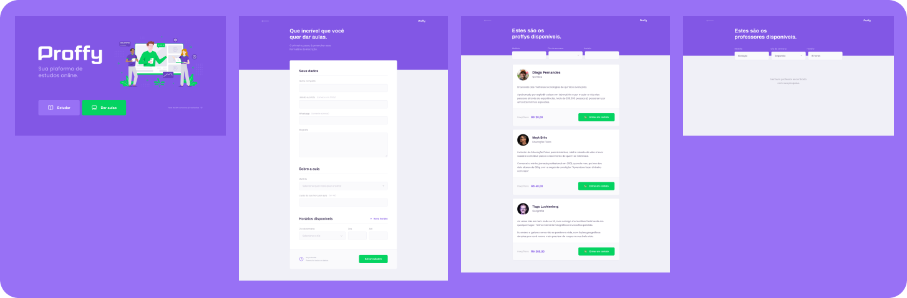

<h1 align="center">
  
   
  
  
   
  
  
  
</h1>

 <a href="#description">Descrição</a> •
 <a href="#roadmap">Roadmap</a> • 
 <a href="#features">Features</a> • 
 <a href="#tecnologias">Tecnologias</a> •
 <a href="#install">Instalação</a> • 
 <a href="#license">Licença</a> • 
 <a href="#autor">Autor</a>

  Proffy e uma plataforma de aulas online, com o proffy você tem a opção de ser um estudante ou um professor, a
  plataforma tem sua versão Web e a sua versão Mobile.

<h1 align="center" id="roadmap">
  
   
  
</h1>

<h2 id="features">
  Features
</h2>

### Web

- [x] Opção de estudar ou dar aulas.
- [x] Fórmulario para cadastro de professores.
- [x] Fitragem de professores.
- [x] Entrar em contado com os professores pelo Whatsapp.

### Mobile

- [x] Opção de estudar ou dar aulas.
- [x] Fitragem de professores.
- [x] Entrar em contado com os professores pelo Whatsapp.
- [x] Opção para você favoritar os professores.
- [x] Listagem dos professores que você favoritou.

<h2 id="tecnologias">
  🛠 Tecnologias
</h2>

 As seguintes ferramentas foram usadas na construção do projeto:

- [Expo](https://expo.io/)
- [Node.js](https://nodejs.org/en/)
- [React](https://pt-br.reactjs.org/)
- [React Native](https://reactnative.dev/)
- [TypeScript](https://www.typescriptlang.org/)
- [StyledComponents](https://styled-components.com/)

<h2 id="install">
  📝 Instalação
</h2>

<h2 id="license">
  📝 Licença
</h2>

Copyright © 2020 [Alexandre Costa](https://github.com/alexandredev3). 
This project is [MIT](./LICENSE.txt) licensed.

  <strong> With ❤ </strong> <a target="_blank" href="https://github.com/alexandredev3">Alexandre Costa</a>🚀

 
